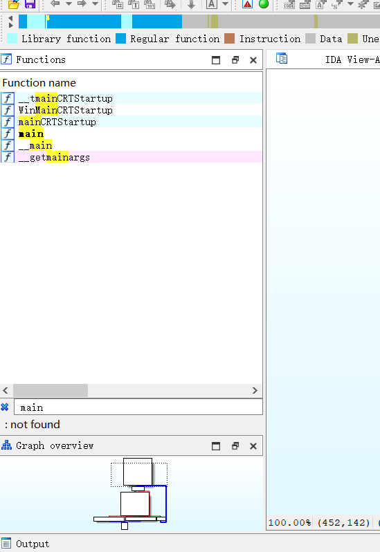
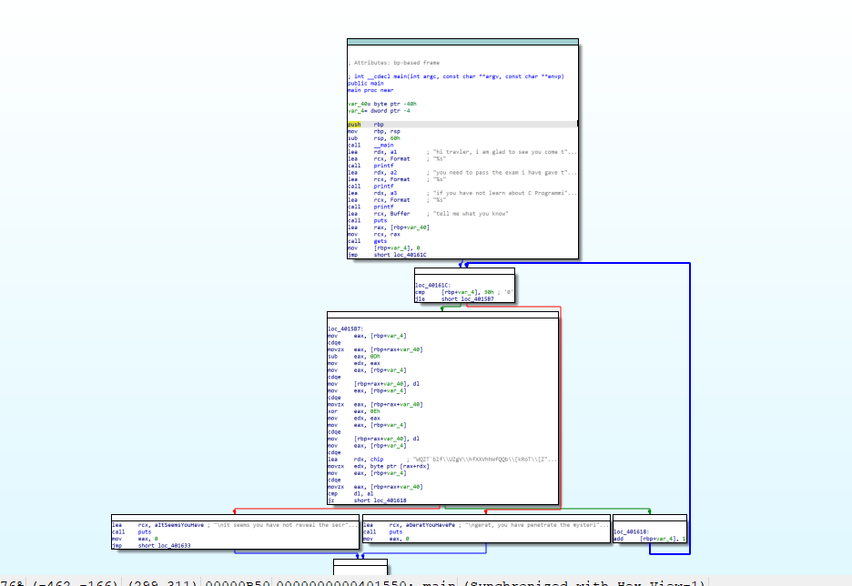

本题主要考察选手是否会使用ida

使用ida打开文件,在左侧函数窗口,按ctrl+F打开搜索框 ,输入main  

这里的main其实是最常见的函数入口,一般来说做逆向题都会存在一个main函数  



  
打开之后,会看到一个汇编窗口,实际上我们做逆向的过程中,在后期都会需要使用到阅读汇编这个过程,如果不会阅读汇编,那你就不能能说自己是做逆向的,这里考虑到大家的基础问题,大家可以直接按F5,让ida帮你反编译出对应的汇编代码  
  

  
这里阅读理解的过程我就不赘述了,如果你学过c语言就肯定能多多少少看懂一部分的内容  

这里主要是对你输入的一个字符串,每一个字符单独拿出来,对它减13,然后再异或一个0xEu,这里的0xE是多少大家打开电脑上的计算器用十六进制看一下,就可以得到对应的十进制数  

由于加减法和异或运算都是可逆的,这里在逆向的过程中,只需要对密文的每一位字符,异或一次0xE,然后再加13,就可以得到对应的原文了

如果你还不会ida的基本使用方法,我的建议是看看这个视频  

[点我跳转](https://www.bilibili.com/video/BV1em4y1P7PM/?spm_id_from=333.999.0.0)

exp 
```
#include<bits/stdc++.h>
using namespace std;
string  a=R"(WQZT`blf\UZgV\hfXXVhhWfQQb\[kRoT\[ZXP\iUV\hVXkVi~)";
signed main(){
	for(auto i:a){		
		cout<<char((i^0xEu)+13);
	}
}
```


源码  


```

#include<stdio.h>
char a1[]="hi travler, i am glad to see you come to here\n";
char a2[]="you need to pass the exam i have gave to you\n";
char a3[]="if you have not learn about C Programming Language, you should learn about it\nor you will never crack our secret\n";
char a4[]="if you see this sentence , it means you have master how yo use ida ,that is a nice beginning\n";
char a5[]="and now , i can tell my secret to you,it is\n";
char chip[]={0x57,0x51,0x5a,0x54,0x60,0x62,0x6c,0x66,0x5c,0x55,0x5a,0x67,0x56,0x5c,0x68,0x66,0x58,0x58,0x56,0x68,0x68,0x57,0x66,0x51,0x51,0x62,0x5c,0x5b,0x6b,0x52,0x6f,0x54,0x5c,0x5b,0x5a,0x58,0x50,0x5c,0x69,0x55,0x56,0x5c,0x68,0x56,0x58,0x6b,0x56,0x69,0x7e};
signed main(){

 
    printf("%s",a1);
    printf("%s",a2);
    printf("%s",a3);
    
    printf("tell me what you know\n");
    char flag[49];
    gets(flag);

    if(sizeof(flag)!=49){
        printf("you stupid outcomer\n");
    }
    else{

        for(int i=0;i<49;i++){
            
            flag[i]-=13;
            flag[i]^=14;
            if(chip[i]!=flag[i]){
                printf("\nit seems you have not reveal the secret in our country\n");
                return 0;
            }
        }
        printf("\ngerat, you have penetrate the mysteries!!!\n");

    }


}

```