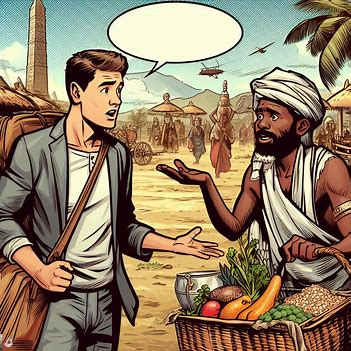

小朋友,你知道什么是异或运算吗？  

在古老的东方国度"派森"里流传着一种神秘的语言,这个国家里的人可以识别世界上任何一个国家的语言,而他们正是使用了一种名为"base64"的神秘魔法:他们会将一切外来语言转化为base64,然后对base64进行一些神秘的仪式,然后再将base64转化为派森国的语言。  

而你，作为误入派森国的旅行者，你要做的第一件事情便是掌握派森国的语言机制,然后跟你眼前的烧烤摊老板买点吃的,不然你就要饿死在这了!!!

