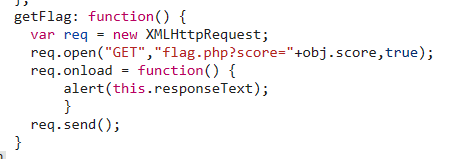

1.MISC
    
    MISC1
        题目直接说了是个伪加密，010Editor改一下标记位回00 00，解压后里面还有一个加密的压缩包，出题人很诚实的把加密方式直接告诉你了（还是看了一下标记位都是09 00），所以archprv八位数字跑一下发现是11451400（臭死了），解压出来一个txt文件，看一下里面是有Unicode控制符的，复制出来，零宽字符隐写解密得到一半的flag；然后整个txt文件除去Unicode控制符是base64隐写，解出来就是另一半的flag

    MISC2
        图片少了一半（确信

        import os
        import binascii
        import struct

        crcbp = open("1.png", "rb").read()    #打开图片
        for i in range(2000):
            for j in range(2000):
                data = crcbp[12:16] + \
                    struct.pack('>i', i)+struct.pack('>i', j)+crcbp[24:29]
                crc32 = binascii.crc32(data) & 0xffffffff
                if(crc32 == 0xe8d3c143):    #图片当前CRC
                    print(i, j)
                    print('hex:', hex(i), hex(j))

        跑一下发现图片本来是1920*1080的，010Editor把尺寸改回去就可以看见左下角写着的flag了

2.Crypto

    easy_crypto
        没什么好说的，看了下hint，凯撒密码，直接结束

    fence
        题如其名，栅栏加密，直接枚举解密了，栏数=5的时候得到flag

    easy_rsa
        RSA把p、q、e、c都告诉你了还要我说什么
        贴一下几行代码

        phi_N = (p - 1) * (q - 1)
        d = mod_inverse(e, phi_N)
        m = pow(c, d, p * q)
        flag= m.to_bytes((m.bit_length() + 7) // 8, 'big').decode()

3.Reverse

    逆向挑战level_0
        IDA打开可以一眼看到flag，过

    逆向挑战level_1
        food_seller_said = b"ZmxhZ3tFdmVyeV9BcHBsZV9Db3N0X1RoaXJ0eV9jb2lufQ=="
        拿去base64解码一下，过

    逆向挑战level_2
        IDA打开，TAB看一下代码，是输入值先-13再xor 0xE和chip做比较，直接把chip的值异或回去再加13就得到flag，过

4.Web

    Get_Problem
        读代码，然后补上?ats=flag结束

    2048
        随便按了一局发现5w分拿flag，然后开发者工具看一下代码，找到
        
        补上flag.php?score=500001，就直接拿到flag了

    unserilize
        去搜了下反序列化做了很久incorrect
        然后hint出来之后尝试直接访问了flag.php，出乎意料地直接拿到了正确的flag，所以本题真的用到了反序列化吗（雾

5.Pwn

    nc_problem
        nc连一下然后尝试性cat flag，结束