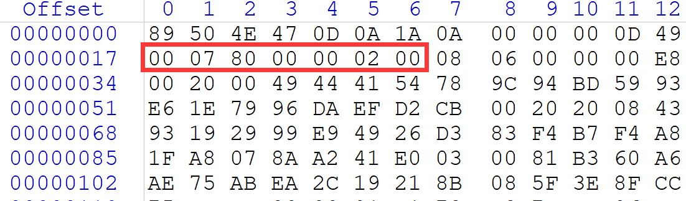
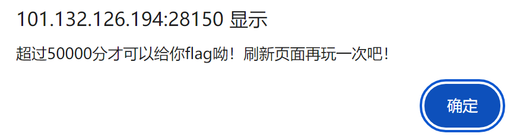
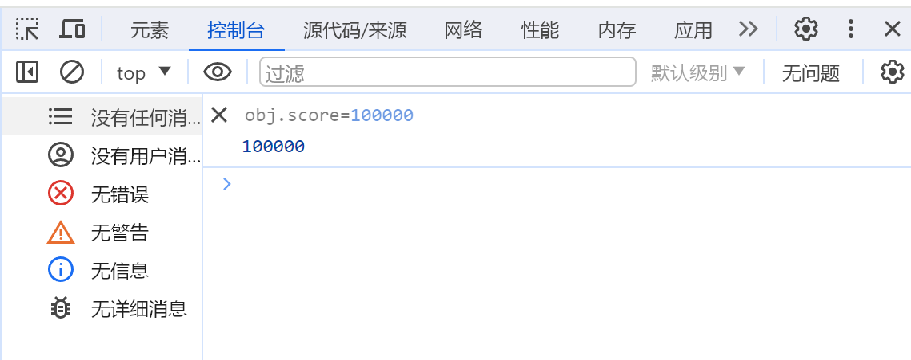
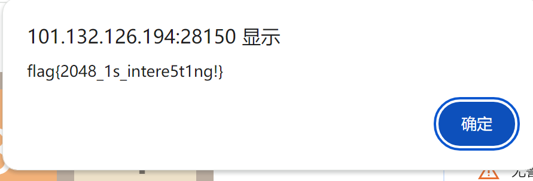

# Misc

## MISC2

- 提示 *图片好像少了一半？*
- 去查了一下ctf misc图片少一半，发现要用winhex，就去下了一个
- 属性里查看图片原本宽高 $1920*512$，打开计算器，切换程序员模式，转成16进制就是 $0780*0200$，对应winhex的，把200改成400保存，但是依然没有flag
- 想了很久，考虑了应该有其他可能，但是尝试很久没有结果。最后打算用python找出图片的真实宽度，但是比较懒，直接调成800摆烂，结果成功了

# Pwn

## nc_problem

- 直接在windows上打不开，开了梯子也不行，于是用kali试了一下，火狐可以打开

  ```html
  /bin/sh: 1: GET: not found
  /bin/sh: 2: Host:: not found
  /bin/sh: 3: Syntax error: "(" unexpected
  ```

  但似乎没什么用

- 查了一下ctf pwn nc，发现是原题，还是签到题

- 直接在终端里输入`nc 101.132.126.194 28066`

- 然后再输入`cat flag`，得到flag

- 一开始反复报错 **connection refused**，后来又是查防火墙又是查端口都无解，甚至在windows上装了nc，最后用root权限试了一下就可以了，然后后来正常权限打开也行了

# Reverse

## 逆向挑战level_0

- 下载 IDA，本来想找群文件的，结果发现没了，所以自己去网上找的
- 启动 IDA，把 grasp.exe 拖进去，查找 flag 或者运气好直接发现 flag 

## 逆向挑战level_1

- 阅读 ezxor.md 提示用base64解密
- 用之前的解密网站 https://ctf.bugku.com/tools
- 找到 *Base64编码解码* 输入`ZmxhZ3tFdmVyeV9BcHBsZV9Db3N0X1RoaXJ0eV9jb2lufQ==`就找到了答案
- 运行 main.py, 输入解密之后的flag，提示成功

# Web

## Get_Problem

- 查了一下，同样是原题，复现即可
- GET传参，在地址栏后输入`/?ats=flag`刷新即可

## 2048

- 查了一下，是一道21年的题目，姑且假定没改。

- 随便玩了一下，

  更加确定是需要修改源码获取flag了

- 按照原题思路，查看源码（*F12*）

- 阅读源码找到分数结算` obj.score`，在控制台修改值为100000

  

- 刷新，随便玩一局，得到flag

  

## unserilize

- 由于出题方到最后一天下午才发现出了点小问题，所以临时改了题目
- 查看Hint，flag在和index.php同文件的flag.php中
- 直接在地址栏最后输入/flag.php，获得flag

# Crypto

## easy_crypto

- 查看Hint，凯撒密码

- 找到了一个密码工具集合网站 https://ctf.bugku.com/tools

- 找到 *凯撒密码* 输入题干就找到了答案

  此处可以枚举找到以flag开头的字符串，也可以大概自己算一下，jpek和flag四个字母均差4，偏移量直接输入4也可以出答案

## fence

- 查看Hint，栅栏密码

- 用之前那个密码工具集合网站 https://ctf.bugku.com/tools

- 找到 *栅栏密码* 输入题干就找到了答案

  枚举解密得到以flag开头的明文

## easy_rsa

- 查看Hint，rsa

- 查了一下rsa，此处已知p q e c，求m，查到了python脚本，直接复制粘贴（不唯一）

  ```python
  import gmpy2
  from Crypto.Util.number import *
  
  p = 157173933678865829796588771859730626751979694456452522968152651069129392799258217265185848448685585775544813903532906730614939030283007417606598779500056952754181261190054483026447877747920219900804090686875343878530050195569754923626003932685350379021185849905416227380846266989977230446347850752132780995851
  q = 118137767140663032316717597565829355889298910256704336671094654247806607566526109499776038326918920524704233758475838430215153530040405269217410220826570758329054694465812191453918843350294115299488478793133177286138570853777934505763392200709694896022800642350666804081284587102146286116419267715475787118431
  c = 1244139621221798336011360777421383618270693953475688231676631467752812850168611669256137287976524541754051790468466155884867478079178451985211020451119319459880266560291961483221117813697171271969713905268051600082796733118818786832199939743042295618497558011083468549923528995469347146484713544146105249963392344122452750729993525077680496331781965676800289439912777970469174249411291922332016851536533041294776774291868620601249388837363759409881738311233126615418586444913637689452364713121292232437577065849021283077035346442966749362596589942604455352794718895095326303151696878518630642608238234148501381581264
  e = 65537
  n = p * q
  phi_n = (p - 1) * (q - 1)
  d = gmpy2.invert(e, phi_n)
  m = long_to_bytes(pow(c, d, n))
  print(m)
  ```

- 输入大数字的时候注意手动去掉换行产生的空格

- 没导入的包用pip导入即可